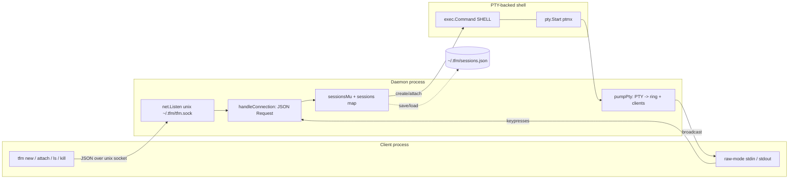

# tfm — Terminal Multiplexer in Go

> A minimal `tmux`-style terminal multiplexer with a Unix-domain-socket daemon, persistent PTY sessions, multi-client attach, and on-disk session recovery. ~700 lines of pure Go.

[](https://github.com/Chetas-Patil/tfm/actions/workflows/ci.yml)
[](https://github.com/Chetas-Patil/tfm/actions/workflows/security.yml)
[](https://go.dev/dl/)
[](#platform-support)

---

## Why this exists

A pedagogical-but-real-world implementation of the building blocks behind a session-oriented terminal multiplexer:

- **PTY allocation & I/O pumping** (`creack/pty`)
- **Persistent background daemon** that survives client disconnects
- **Unix-domain-socket IPC** with newline-delimited JSON requests/responses
- **Bounded in-memory scrollback** (512 KiB ring) for late-attaching clients
- **On-disk session manifest** (`~/.tfm/sessions.json`) for restart recovery
- **Detach key sequence** (`Ctrl+B d`) wired via raw-mode keypress detection

## System Architecture



## Attach Lifecycle

```mermaid
sequenceDiagram
    autonumber
    participant U as User
    participant C as tfm client
    participant D as tfm daemon
    participant S as Session (PTY)

    U->>C: tfm attach -t work
    C->>D: ensureDaemonConnected (auto-spawn if down)
    C->>D: {action:"attach", name:"work", rows, cols}
    D->>D: sessionsMu.Lock; lookup
    alt session exists
        D-->>C: {message:"Attached"}
        D->>S: register conn in sess.Clients
        S-->>C: replay sess.History (up to 512 KiB)
        loop per keystroke
            U->>C: keypress
            C->>D: bytes (raw-mode stdin)
            D->>S: sess.Pty.Write
            S-->>D: stdout/stderr bytes
            D-->>C: broadcast to all clients
        end
        U->>C: Ctrl+B, d
        C-->>D: close conn
        D->>D: drop conn from sess.Clients (PTY persists)
    else session missing
        D-->>C: {error:"Session not found"}
    end
```

## Quick Start

```bash
# Install (uses go.mod's module path)
go install ./...

# Or build locally
go build -o tfm . && sudo mv tfm /usr/local/bin/

# New session
tfm new -s work

# Detach: Ctrl+B then d
# Re-attach
tfm attach -t work

# List active + saved sessions
tfm ls

# Persist sessions to disk for next daemon start
tfm save

# Kill a session
tfm kill -t work
```

## Concepts

| Type            | Purpose                                                                                  |
|-----------------|------------------------------------------------------------------------------------------|
| `Request`       | JSON envelope for client → daemon RPC: `Action`, `Name`, `Rows`, `Cols`                  |
| `Response`      | JSON envelope for daemon → client RPC: `Error`, `Message`, `Sessions`                    |
| `Session`       | A PTY-backed shell with attached client conns, scrollback ring, and `sync.Mutex`         |
| `SavedSession`  | Manifest entry persisted to `~/.tfm/sessions.json` (`Name`, `Dir`)                       |
| `MaxHistory`    | 512 KiB ring buffer per session — keeps recent output for late attachers                 |

## Operational Notes

- **Daemon lifecycle.** The first client invocation auto-spawns the daemon (`tfm daemon`) if `~/.tfm/tfm.sock` isn't connectable. The daemon stays alive across client exits; `tfm kill` only terminates a single session, not the daemon.
- **Concurrency.** A single `sessionsMu` protects the global `sessions` map; each `Session` has its own `mu` guarding `History` and `Clients`. Writes to client conns happen under the per-session mutex to keep multi-attach output coherent.
- **Backpressure.** `pumpPty` does blocking writes to all attached client conns. A slow/dead client will stall the broadcast. **Future work**: per-client buffered channels with drop-on-overflow.
- **Detach key sequence.** Implemented client-side: `Ctrl+B` then `d` triggers a clean conn close; `Ctrl+B Ctrl+B` sends a literal `^B` to the inner shell.
- **Storage paths.** Defaults to `$HOME/.tfm/{tfm.sock,sessions.json}`. If `$HOME` is unresolvable, falls back to `/tmp` (intentionally permissive for dev).

## Security Considerations

| Concern                         | Status                                                                                       |
|---------------------------------|----------------------------------------------------------------------------------------------|
| **Local-only IPC**              | Unix socket at `~/.tfm/tfm.sock` (mode `0700` directory)                                     |
| **PTY isolation**               | Each session runs as the daemon user; no privilege escalation                                |
| **Saved-session permissions**   | `sessions.json` is currently `0644` — **TODO** tighten to `0600` since paths can be sensitive |
| **No remote attach**            | Intentional — no TCP listener, no auth                                                       |
| **No PTY input sanitization**   | Any client connected to the socket can drive the PTY — same trust boundary as `~`            |

## Scalability & Roadmap

| Lever                          | Today                                          | Roadmap                                              |
|--------------------------------|------------------------------------------------|------------------------------------------------------|
| Sessions per daemon            | Bounded only by FDs                            | Add session-count cap + LRU eviction                 |
| Scrollback per session         | 512 KiB byte ring                              | Configurable; spill-to-disk for long sessions        |
| Multi-attach broadcast         | Synchronous loop over `sess.Clients`           | Per-client buffered channel + drop-policy            |
| Session restoration            | Names + dirs only                              | Capture exit-on-detach state (env, last cmd, etc.)   |
| Window resize                  | `pty.Setsize` on attach                        | SIGWINCH propagation + active resize on all clients  |
| Tests                          | None                                           | Daemon ↔ client round-trip integration tests         |

## Development

```bash
# Format + vet
go fmt ./... && go vet ./...

# Lint (requires golangci-lint v2)
golangci-lint run

# Race-detector build (smoke)
go build -race ./...

# Vulnerability scan
go install golang.org/x/vuln/cmd/govulncheck@latest
govulncheck ./...
```

## Platform Support

Tested on macOS (arm64) and Linux (amd64). Windows is unsupported — there is no PTY equivalent and the IPC layer assumes Unix-domain sockets.

## License

See [LICENSE](LICENSE).
